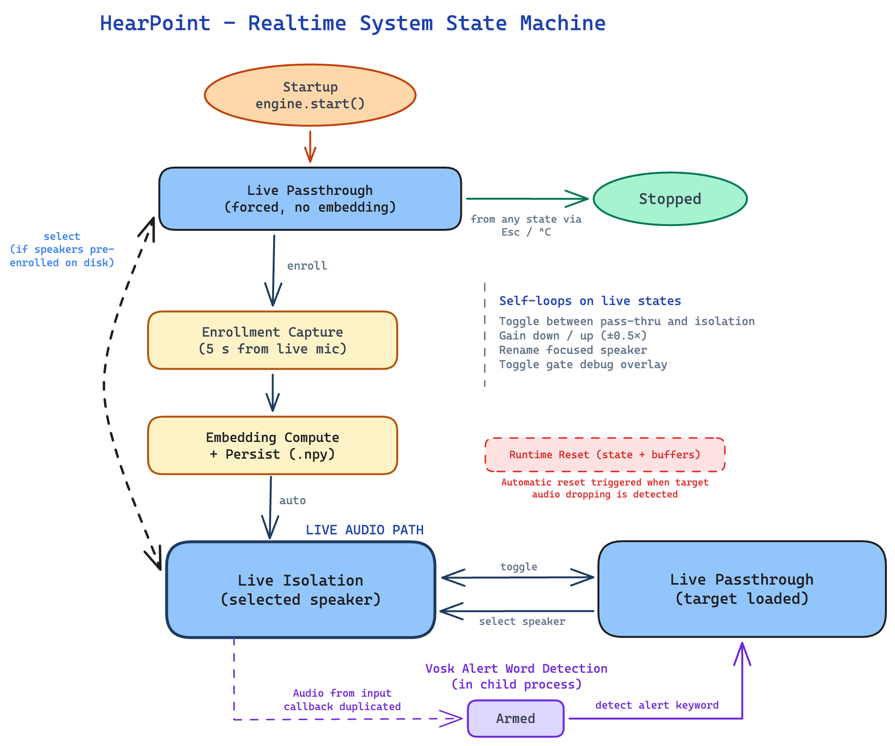
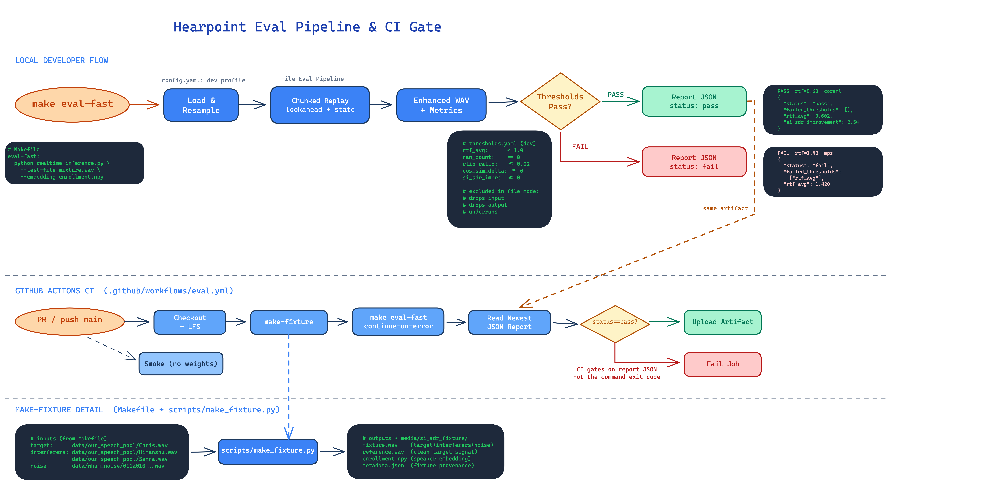
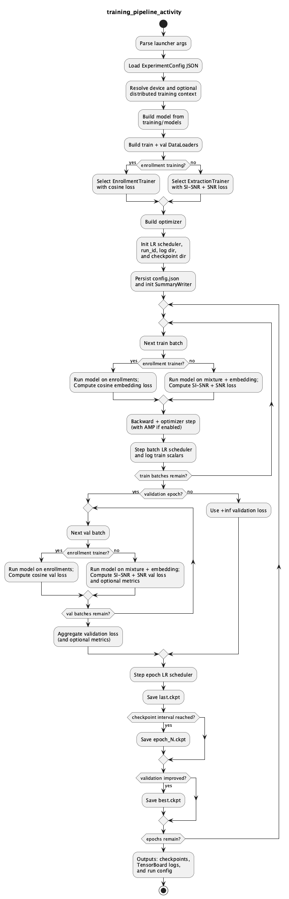

# Hearpoint.ai

### Real-Time Selective Hearing for Target Speaker Isolation

[](#results)
[](#architecture)
[](#key-features)
[](LICENSE)

> A wearable prototype that isolates a single enrolled speaker from a noisy, multi-speaker environment in real time. Rather than amplifying everything like a conventional hearing aid, Hearpoint.ai extracts **one chosen voice** — tackling the cocktail party problem at its core.

<p align="center">
  
</p>

---

## Key Features

- **Real-time speaker isolation** — Streaming extraction on live binaural audio, ~17 ms end-to-end latency.
- **Speaker enrollment** — Record a short sample, generate a voice embedding, and lock onto that speaker.
- **Fully local inference** — All processing runs on-device via CoreML. No cloud, no data leaves the machine.
- **Passthrough mode** — Instant switch to unprocessed ambient audio when isolation isn't needed.
- **Runtime self-healing** — Auto-reset, spectral subtraction, and energy gating keep the stream stable.
- **Macro-pad + CLI control** — Physical controls for enrollment, speaker switching, gain, and mode toggling.

---

## How It Works

1. **Enroll** — Record a short sample of the target speaker. A voice embedding is computed and saved.
2. **Capture** — Binaural microphones on the headset pick up the full acoustic scene in stereo.
3. **Extract** — A causal, streaming TFGridNet model isolates the enrolled speaker's voice in real time.
4. **Clean up** — Spectral subtraction and noise gating remove residual artifacts.
5. **Play back** — The cleaned signal is delivered to the headphones with low delay.

<p align="center">
  
</p>

---

## Architecture

The extraction model is a **streaming, causal TFGridNet** conditioned on a speaker embedding. The original offline TFGridNet was adapted for real-time use with:

- Buffered convolution and deconvolution layers
- Carried state in the inter-time RNN
- Bounded-context multi-head attention

Runtime parameters:
- **16 kHz** stereo in / stereo out
- **128-sample chunks** (~8 ms per chunk)
- CoreML backend on Apple Silicon

The prototype hardware: Sony WH-1000XM4 headphones with externally mounted binaural microphones on a custom 3D-printed mount, controlled via a macro-pad.

---

## Quick Start

### Prerequisites

- macOS with Apple Silicon (M1/M2/M3)
- [Conda](https://docs.conda.io/en/latest/miniconda.html)

### Setup

```bash
# Clone and create environment
git clone git@github.com:Hearpoint-ai/hearpoint_realtime.git
cd hearpoint_realtime
conda env create -f environment.yml
conda activate hearpoint-realtime
```

### Usage

```bash
# List available audio devices
make list-devices

# Enroll a speaker by recording from microphone (5 seconds)
make enroll-record NAME=Hady DURATION=5

# Enroll from an existing WAV file
make enroll NAME=Hady AUDIO=/path/to/sample.wav

# Run the live demo
make demo-test

# Run with audio recording enabled
make recording

# Run evaluation
make eval-fast

# Run tests
make tests
```

---

## Results

### Performance

| Metric | Value |
|--------|-------|
| CoreML isolation-mode RTF | 0.705 |
| Average backend latency | 5.42 ms |
| Mean session latency | ~17 ms |
| p99 session latency | ~20 ms |

### User Study Feedback

| Category | Score |
|----------|-------|
| Ease of setup | 10.0 / 10 |
| Noise reduction | 9.1 / 10 |
| Naturalness | 8.3 / 10 |
| Overall satisfaction | 7.1 / 10 |
| Consistency | 4.8 / 10 |
| Comfort | 3.3 / 10 |

> Comfort and consistency scores reflect the bench-top prototype form factor and sensitivity to head movement — not fundamental model limitations.

---

## Audio Post-Processing

Three layers stabilize the output beyond the neural model:

- **Spectral subtraction** — A captured noise profile is subtracted in the frequency domain to reduce stationary background noise.
- **Noise gate** — Energy-based gating suppresses low-level leakage when the target speaker pauses.
- **Auto-reset** — When the output/input energy ratio stays abnormally low (e.g., head turns causing the target to fade), the streaming state is automatically reset.

---

## Engineering Pipeline

<p align="center">
  
</p>

The project includes CI-gated evaluation pipelines with threshold-based pass/fail checks to catch performance regressions on every push. Training runs are cloud-orchestrated with structured artifact storage (checkpoints, logs, configs).

<details>
<summary>Training pipeline detail</summary>
<p align="center">
  
</p>
</details>

---

## Enrollment Exploration

Three enrollment approaches were investigated:

| Method | Outcome |
|--------|---------|
| **Resemblyzer** (baseline) | Best end-to-end extraction quality — used in final system |
| Student-teacher distillation | Did not outperform Resemblyzer downstream |
| Beamformer-assisted enrollment | Did not outperform Resemblyzer downstream |

This was an important engineering result: the simplest approach won on end-to-end performance.

---

## Known Limitations

- Bench-top wearable form factor (not miniaturized)
- Enrollment degrades in noisy conditions
- Performance drops when the target speaker moves relative to the listener's head
- Low-level leakage during target speaker pauses
- Limited safety/alert fallback validation
- No calibrated SPL-limited output validation

---

## Repository Structure

```text
.
├── src/
│   ├── realtime/       # streaming inference engine, audio I/O, DSP
│   ├── ml/             # training, evaluation, model definitions
│   ├── models/         # model architecture code
│   ├── configs/        # runtime and experiment configs
│   └── tools/          # utilities
├── scripts/            # demo, enrollment, evaluation, fixture generation
├── diagrams/           # architecture diagrams and poster assets
├── checkpoints/        # model weights
├── weights/            # exported model artifacts
├── data/               # speech pools and noise datasets
├── media/              # enrollments, recordings, noise captures
├── static/             # sound effects
├── environment.yml     # conda environment spec
└── Makefile            # all common commands
```

---

## Team

**Hearpoint.ai — Team 31**
McMaster University — Capstone 2025–2026

| Name | Program |
|------|---------|
| Hady Ibrahim | Software & Biomedical Engineering |
| Himanshu Singh | Mechatronics Engineering |
| Derron Li | Software & Biomedical Engineering |
| Matthew Mark | Mechatronics Engineering |

---

## Citation

```bibtex
@misc{hearpointai2026,
  title  = {Hearpoint.ai: Selective Hearing Aid for Target Speaker Isolation},
  author = {Ibrahim, Hady and Singh, Himanshu and Li, Derron and Mark, Matthew},
  year   = {2026},
  note   = {McMaster University Capstone Project}
}
```
