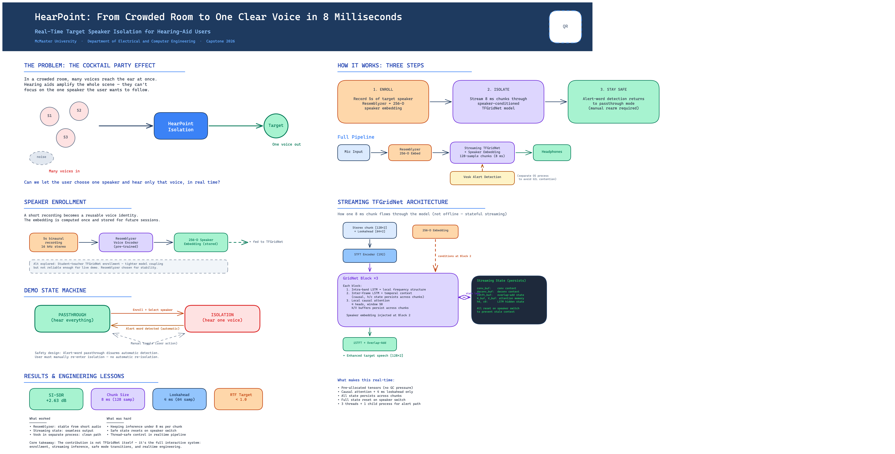
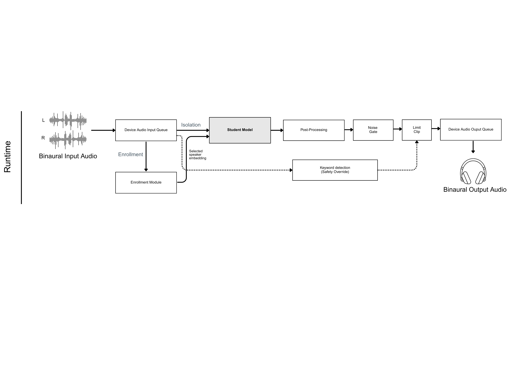
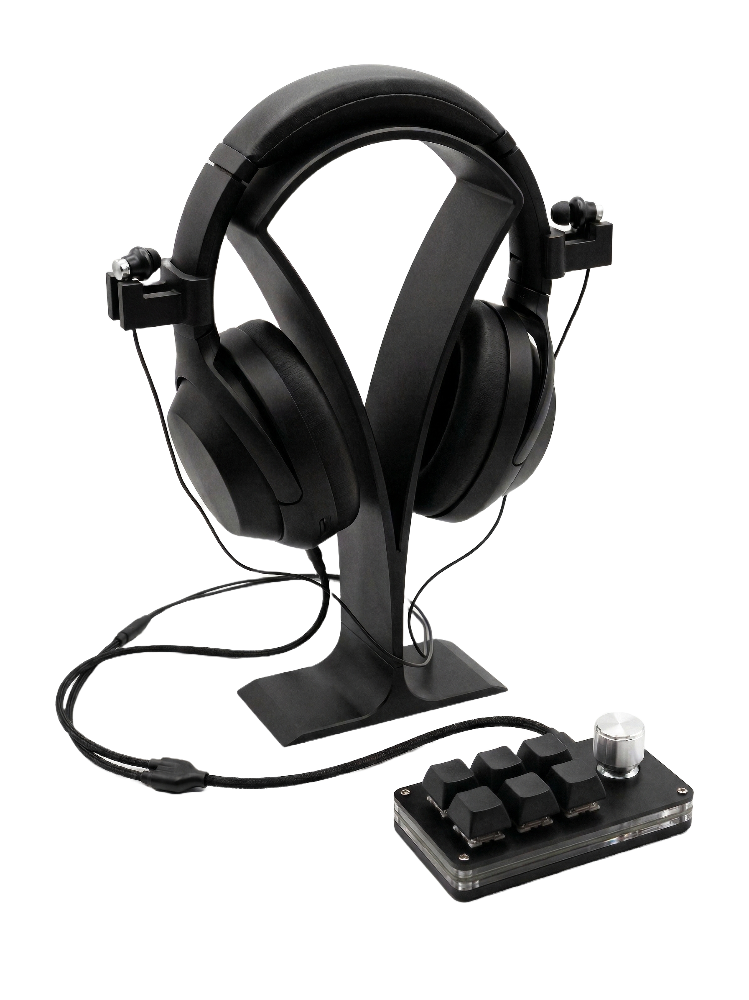
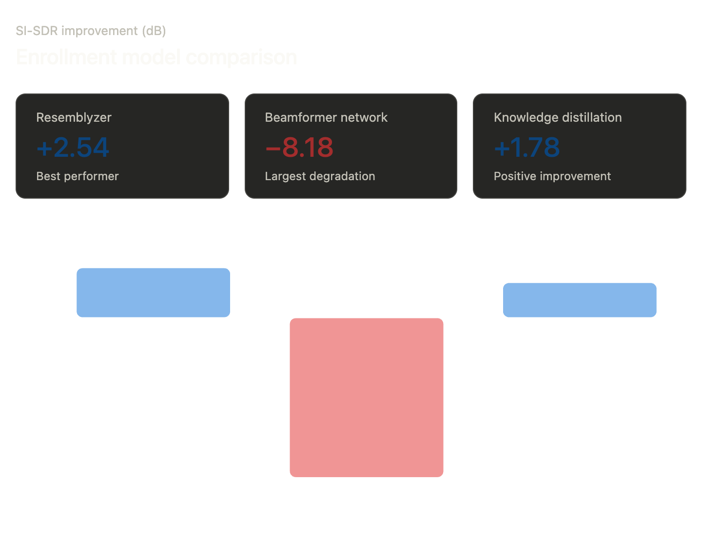

# Hearpoint.ai

### Real-Time Selective Hearing for Target Speaker Isolation

🏆 **Winner — McMaster Capstone Expo 2026**

[](#results)
[](#architecture)
[](#key-features)
[](LICENSE)

> A wearable prototype that isolates a single enrolled speaker from a noisy, multi-speaker environment in real time. Rather than amplifying everything like a conventional hearing aid, Hearpoint.ai extracts **one chosen voice** — tackling the cocktail party problem at its core.

<p align="center">
  <video src="https://github.com/user-attachments/assets/REPLACE_WITH_UPLOADED_VIDEO_ID" width="100%" controls></video>
</p>

<!-- To embed the demo video on GitHub:
     1. Go to github.com → your repo → Issues → New Issue
     2. Drag-and-drop videos/HearpointCapstoneDemo.mp4 into the comment box
     3. GitHub will generate a URL like https://github.com/user-attachments/assets/...
     4. Replace the video src above with that URL, then delete this comment block -->

<p align="center">
  
</p>

---

## Key Features

- **Real-time speaker isolation** — Streaming extraction on live binaural audio, ~17 ms end-to-end latency.
- **Speaker enrollment** — Record a short sample, generate a voice embedding, and lock onto that speaker.
- **Fully local inference** — All processing runs on-device via CoreML. No cloud, no data leaves the machine.
- **Passthrough mode** — Instant switch to unprocessed ambient audio when isolation isn't needed.
- **Runtime self-healing** — Auto-reset, spectral subtraction, and energy gating keep the stream stable.
- **Macro-pad + CLI control** — Physical controls for enrollment, speaker switching, gain, and mode toggling.

---

## How It Works

1. **Enroll** — Record a short sample of the target speaker. A voice embedding is computed and saved.
2. **Capture** — Binaural microphones on the headset pick up the full acoustic scene in stereo.
3. **Extract** — A causal, streaming TFGridNet model isolates the enrolled speaker's voice in real time.
4. **Clean up** — Spectral subtraction and noise gating remove residual artifacts.
5. **Play back** — The cleaned signal is delivered to the headphones with low delay.

<p align="center">
  
</p>

---

## Architecture

The extraction model is a **streaming, causal TFGridNet** conditioned on a speaker embedding. The original offline TFGridNet was adapted for real-time use with:

- Buffered convolution and deconvolution layers
- Carried state in the inter-time RNN
- Bounded-context multi-head attention

Runtime parameters:
- **16 kHz** stereo in / stereo out
- **128-sample chunks** (~8 ms per chunk)
- CoreML backend on Apple Silicon

<p align="center">
  
</p>

<p align="center"><em>Final prototype: Sony WH-1000XM4 with custom 3D-printed binaural microphone mounts and programmable macro-pad with gain knob.</em></p>

---

## Quick Start

### Prerequisites

- macOS with Apple Silicon (M series)
- [Conda](https://docs.conda.io/en/latest/miniconda.html)

### Setup

```bash
# Clone and create environment
git clone git@github.com:Hearpoint-ai/hearpoint_realtime.git
cd hearpoint_realtime
conda env create -f environment.yml
conda activate hearpoint-realtime
```

### Usage

```bash
# List available audio devices
make list-devices

# Enroll a speaker by recording from microphone (5 seconds)
make enroll-record NAME=Hady DURATION=5

# Enroll from an existing WAV file
make enroll NAME=Hady AUDIO=/path/to/sample.wav

# Run the live demo
make demo-test

# Run with audio recording enabled
make recording

# Run evaluation
make eval-fast

# Run tests
make tests
```

---

## Results

### Hardware Backend Comparison

We benchmarked four inference backends. CoreML on Apple Silicon was the only configuration that consistently achieved real-time performance (RTF < 1.0):

| Backend | RTF | Avg Latency | Input Drops | Output Drops |
|---------|-----|-------------|-------------|--------------|
| **CoreML (ANE)** | **0.705** | **5.42 ms** | **0** | **2** |
| MPS (GPU) | 1.048 | 7.71 ms | 26 | 31 |
| Jetson (CUDA) | 1.132 | 7.22 ms | 53 | 130 |
| CPU | >1.3 | >15 ms | — | — |

**Why CoreML won:** The Apple Neural Engine (ANE) is dedicated silicon for neural network operations — matrix multiplications, convolutions, activation functions. Unlike GPU or CPU backends, the ANE eliminates kernel launch overhead entirely. There is no "commute" cost — the model runs on hardware built specifically for this workload.

GPU backends (MPS, Jetson CUDA) had fast raw inference but the overhead of scheduling many small 4ms GPU operations for 128-sample chunks made the total RTF exceed 1.0. The Jetson's CUDA overhead was especially punishing: every chunk requires CPU-to-GPU memory transfer, kernel launch, and transfer back.

### Latency vs. Regulatory Standards

| Standard | Threshold | Hearpoint |
|----------|-----------|-----------|
| FDA OTC hearing aid limit | 15 ms | **5.42 ms** backend |
| Perceptual imperceptibility (research) | <30 ms | **~17 ms** end-to-end |

Mean session latency of **~17 ms** with p99 at **~20 ms** — well within both the FDA regulatory ceiling and the perceptual threshold where delay becomes noticeable.

### Chunk Compute Breakdown

Each 128-sample chunk (~8 ms of audio at 16 kHz) is processed in three stages:

| Stage | What happens |
|-------|-------------|
| **Prep** | Copy raw audio from NumPy callback into pre-allocated PyTorch tensor, assemble STFT lookahead buffer |
| **Inference** | Forward pass through STFT, causal TFGridNet, and inverse STFT |
| **Post** | Move output tensor back to NumPy, place into output queue for playback |

CoreML's advantage is most visible in the inference stage. Prep and post are slightly larger than MPS due to format conversion between PyTorch tensors, NumPy arrays, and CoreML internal formats — but the inference speedup more than compensates.

### User Feedback

Scores from user testing sessions (1–10 scale):

**Audio Quality**
| Category | Score |
|----------|-------|
| Noise reduction effectiveness | **9.1** / 10 |
| Musical noise / artifacts | **8.8** / 10 |
| Naturalness | **8.3** / 10 |
| Speech clarity | **6.2** / 10 |

**Real-Time Performance**
| Category | Score |
|----------|-------|
| Latency perception | **6.8** / 10 |
| Consistency | **4.8** / 10 |

**Usability**
| Category | Score |
|----------|-------|
| Ease of setup | **10.0** / 10 |
| Comfortability | **3.3** / 10 |

**Overall satisfaction: 7.1 / 10**

> Comfort (3.3) reflects the bench-top prototype form factor — full-size headphones with externally mounted mics — not a fundamental limitation. Consistency (4.8) is tied to head-movement sensitivity, addressed by the auto-reset mechanism.

---

## Audio Post-Processing

Three layers stabilize the output beyond the neural model:

- **Spectral subtraction** — A captured noise profile is subtracted in the frequency domain to reduce stationary background noise.
- **Noise gate** — Energy-based gating suppresses low-level leakage when the target speaker pauses.
- **Auto-reset** — When the output/input energy ratio stays abnormally low (e.g., head turns causing the target to fade), the streaming state is automatically reset.

---

## Enrollment Exploration

Three enrollment approaches were investigated to improve robustness to noisy enrollment conditions. Each enrollment model (~1M parameters) was trained from scratch on 2x NVIDIA 4090 GPUs over approximately one week.

<p align="center">
  
</p>

| Method | SI-SDR Improvement | Outcome |
|--------|-------------------|---------|
| **Resemblyzer** (baseline) | **+2.54 dB** | Best performer — used in final system |
| Knowledge distillation | +1.78 dB | Positive improvement, but did not surpass Resemblyzer |
| Beamformer network | -8.18 dB | Largest degradation — could not separate noise from signal |

Despite the significant engineering investment, the pre-trained Resemblyzer baseline outperformed both custom-trained alternatives on downstream extraction quality. This was an important result: the simplest approach won on end-to-end performance.

---

## Known Limitations

- Bench-top wearable form factor (not miniaturized)
- Enrollment degrades in noisy conditions
- Performance drops when the target speaker moves relative to the listener's head
- Low-level leakage during target speaker pauses
- Limited safety/alert fallback validation
- No calibrated SPL-limited output validation

---

## Repository Structure

```text
.
├── src/
│   ├── realtime/       # streaming inference engine, audio I/O, DSP
│   ├── ml/             # training, evaluation, model definitions
│   ├── models/         # model architecture code
│   ├── configs/        # runtime and experiment configs
│   └── tools/          # utilities
├── scripts/            # demo, enrollment, evaluation, fixture generation
├── diagrams/           # architecture diagrams and poster assets
├── checkpoints/        # model weights
├── weights/            # exported model artifacts
├── data/               # speech pools and noise datasets
├── media/              # enrollments, recordings, noise captures
├── static/             # sound effects
├── environment.yml     # conda environment spec
└── Makefile            # all common commands
```

---

## Team

**Hearpoint.ai — Team 31**
McMaster University — Capstone 2025–2026

| Name | Program |
|------|---------|
| Hady Ibrahim | Software & Biomedical Engineering |
| Himanshu Singh | Mechatronics Engineering |
| Derron Li | Software & Biomedical Engineering |
| Matthew Mark | Mechatronics Engineering |

---

## Citation

```bibtex
@misc{hearpointai2026,
  title  = {Hearpoint.ai: Selective Hearing Aid for Target Speaker Isolation},
  author = {Ibrahim, Hady and Singh, Himanshu and Li, Derron and Mark, Matthew},
  year   = {2026},
  note   = {McMaster University Capstone Project}
}
```
